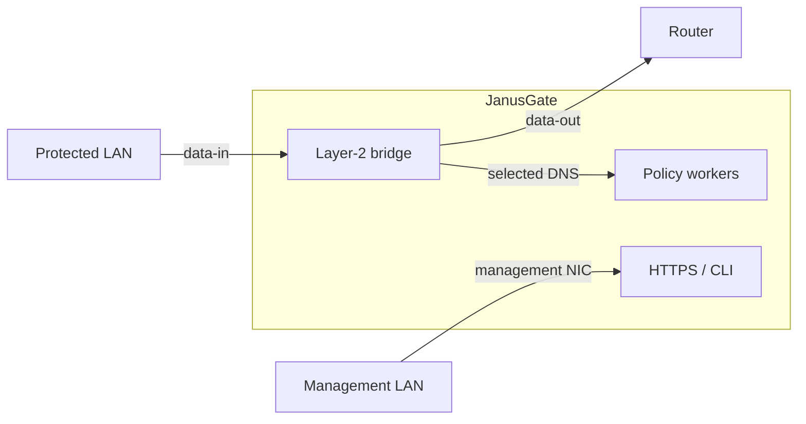

<!--
SPDX-License-Identifier: AGPL-3.0-or-later
Copyright (C) 2026 Marco Fortina <marco_fortina@hotmail.it>
-->

# JanusGate

JanusGate is a transparent, bidirectional Linux and OpenBSD appliance that
applies domain and destination policy to traffic crossing an inline Layer-2
bridge. Classic DNS sent to arbitrary resolvers remains subject to policy
while ordinary traffic stays in the kernel forwarding path.



The appliance separates unprivileged policy processing, privileged network
configuration, and HTTPS administration into distinct processes. Its
management interface is never attached to the data bridge.

## Features

- UDP and TCP classic-DNS policy toward any resolver address.
- Exact and subdomain rules, allow precedence, scopes, local lists, and bounded
  remote sources.
- Drop, REFUSED, NXDOMAIN, and IPv4/IPv6 sinkhole actions for UDP DNS.
- Bounded TCP reassembly, fragmentation handling, DoT/DoQ controls, known
  endpoint sets, and visible TLS SNI policy without TLS interception.
- Transactional network changes with confirmation and rollback.
- HTTPS administration, local and remote CLI, roles, TOTP, tokens, optional
  mTLS, CSRF protection, audit chain, metrics, backups, and diagnostics.
- Alpine 3.24 packages and VM image plus x86_64 and AArch64 Buildroot firmware.
- Native OpenBSD 7.9 build, PF/divert packet path, rc.d services, and installer.
- GCC/Clang, glibc/musl, sanitizer, fuzz, static-analysis, image, and
  performance verification.

JanusGate cannot inspect names hidden by an unidentified DoH endpoint, ECH, a
full-tunnel VPN, or an encrypted proxy. Shared endpoint blocking can affect
unrelated services. See [Limitations](docs/limitations.md).

## Build

The development build uses CMake, Ninja, a C17 compiler, and the system
development libraries listed in [Build and verification](docs/build.md):

```sh
cmake --preset debug
cmake --build --preset debug --parallel 4
ctest --preset debug --output-on-failure
```

## Quick VM lab

Assign exactly three adapters in this order: protected-side data, upstream-side
data, and management. Boot a verified image, open
`https://192.168.77.1/` from the management network, create the first
administrator, and confirm the detected interface roles. Keep the management
adapter outside the data bridge.

Buildroot images perform non-interactive first-boot setup from the reviewed
image configuration. Alpine can be installed into an existing supported
system with `packaging/install/install.sh --dry-run` followed by an explicit
validated configuration and confirmation.

Before placing the appliance inline, verify bridge forwarding, management
isolation, one allowed name, every selected blocked action, local CLI, remote
CLI, backup creation, and an orderly reboot.

## Documentation

- [Architecture](docs/architecture.md) and [packet path](docs/packet-path.md)
- [Threat model](docs/threat-model.md) and [limitations](docs/limitations.md)
- [Web administration](docs/administration.md), [CLI](docs/cli.md), and
  [management API](docs/web-api.md)
- [Build](docs/build.md), [images and firmware](docs/firmware.md),
  [dependencies](docs/dependencies.md), and [performance](docs/performance.md)
- [Operations](docs/operations.md), [privacy](docs/privacy.md), and
  [recovery](docs/recovery.md)
- [Security policy](SECURITY.md) and [contribution guide](CONTRIBUTING.md)

## License

JanusGate is licensed under the GNU Affero General Public License, version 3 or
later. See `LICENSE`.
