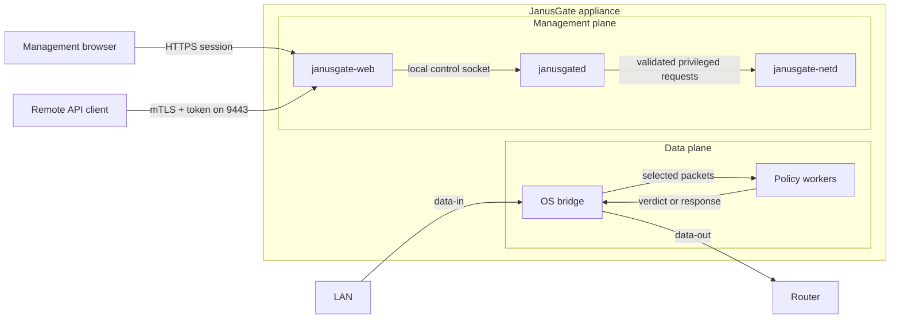

<!--
SPDX-License-Identifier: AGPL-3.0-or-later
Copyright (C) 2026 Marco Fortina <marco_fortina@hotmail.it>
-->

# Architecture

JanusGate is an inline Layer-2 appliance. The data interfaces belong to one
bridge; the management interface remains separate. Ordinary frames stay in
the kernel forwarding path. Linux uses nftables and NFQUEUE for selected DNS
and encrypted-DNS traffic. OpenBSD uses a PF anchor and divert sockets for the
same policy boundary.

## Processes and privilege

- `janusgated` owns the policy database, immutable policy snapshots, packet
  workers, reassembly state, audit records, metrics, backups, and the local
  control protocol. It opens native packet resources during startup, then runs
  as the unprivileged `janusgate` account. Linux retains only `CAP_NET_ADMIN`,
  which the kernel requires when submitting NFQUEUE verdicts.
- `janusgate-netd` is the narrow privileged helper. It validates every request
  before changing bridge, address, packet selection, or appliance power state.
- `janusgate-web` terminates two isolated HTTPS boundaries as `janusgate-web`.
  The browser listener uses sessions without mTLS. The optional TCP 9443 API
  listener requires a trusted client certificate and token. Both validate HTTP
  limits and forward structured requests over the local control socket.
- `janusgatectl` provides full administration either as root through the local
  control socket or remotely through the mandatory-mTLS HTTPS API.
- `janusgate-setup` validates and applies an explicit non-interactive
  installation document.

The web process cannot configure interfaces directly. The data plane cannot
accept unauthenticated web requests. Unix peer credentials, filesystem
permissions, roles, CSRF checks, and revision checks form independent
boundaries.

## State and database

SQLite stores configuration, identities, roles, sessions, tokens, policy
rules, source metadata, events, and the append-only audit chain. Schema
migrations run transactionally. Secrets are hashed or encrypted before
storage; private keys and full backups receive restrictive permissions.
Argon2id password work completes before the short transaction that records an
authentication result. Browser attempts are bounded by source and globally.

Policy evaluation never queries SQLite per packet. `janusgated` builds a
validated immutable snapshot, publishes it atomically to readers, and retires
the previous generation only after active readers leave it. A failed reload
therefore leaves the last complete policy active.

## IPC

The local protocol uses length-bounded, versioned envelopes on Unix sockets.
The control socket is owned by `janusgate:janusgate-control`; the web account
has group access but no access to the database or private configuration.
Root is the only peer authorized for token-free local administration; the web
account must still present a valid session or API credential. Messages reject
unknown fields, invalid lengths, trailing data, and unauthorized operations.

## Deployment

The Alpine appliance uses OpenRC and a writable root filesystem. Buildroot
uses a read-only SquashFS system partition plus an ext4 data partition mounted
at `/data`; configuration, database, certificates, blocklists, audit records,
and logs are bind-mounted from that persistent partition.

OpenBSD installs under `/usr/local`, uses `/var/run/janusgate` for local
sockets, and starts the three processes through native rc.d scripts. The PF
anchor is owned and replaced independently of administrator rules.

Both reference images use the same interface order:

1. data ingress;
2. data egress;
3. management.

See [Packet path](packet-path.md), [Threat model](threat-model.md), and
[Firmware](firmware.md) for the operational details.
