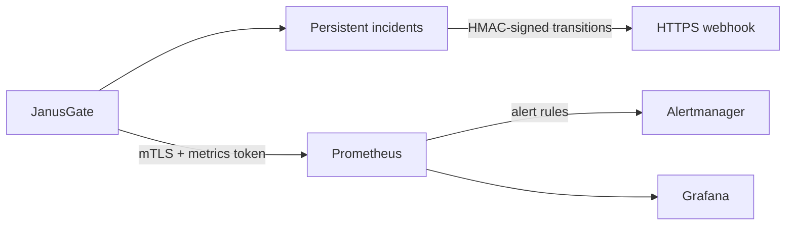

<!--
SPDX-License-Identifier: AGPL-3.0-or-later
Copyright (C) 2026 Marco Fortina <marco_fortina@hotmail.it>
-->

# Monitoring and native alerting

JanusGate provides authenticated Prometheus metrics, persistent native
incidents, and optional signed HTTPS notifications. Prometheus and Grafana run
outside the appliance: no exporter, Grafana agent, or monitoring database is
required on JanusGate.



The metrics endpoint is `/api/v1/metrics` on the dedicated TCP 9443 remote
listener. It requires both a trusted, mapped client certificate and a bearer
token containing only `metrics:read`. The browser listener is deliberately
unsuitable for unattended scraping.

## Prometheus identity

Create a dedicated disabled-for-interactive-use or auditor account, issue a
client certificate for Prometheus from the private CA, and map that exact leaf
certificate to the token owner. The home-lab CA procedure and trust-store
installation are documented in [Remote API](remote-api.md).

Create the token from the local socket with a private JSON document such as:

```json
{
  "user_id": 2,
  "name": "prometheus metrics",
  "scopes": "metrics:read",
  "expires_at": null,
  "source_network": "192.168.77.0/24",
  "requests_per_minute": 30
}
```

Run `sudo janusgatectl token create prometheus-token.json`, copy the displayed
secret once, and store it without a trailing blank line in a mode `0600` file
owned by the Prometheus service account. Store the client key with the same
permissions. The server CA authenticates JanusGate; the client certificate
authenticates Prometheus. They may be issued by different authorities.

Verify the identity before configuring Prometheus:

```sh
janusgatectl --endpoint https://janusgate.example.net:9443 \
  --token-file /etc/prometheus/secrets/janusgate.token \
  --client-cert /etc/prometheus/secrets/prometheus-client.pem \
  --client-key /etc/prometheus/secrets/prometheus-client.key \
  --ca-file /etc/prometheus/secrets/janusgate-server-ca.pem stats
```

Do not disable certificate or hostname verification. Keep TCP 9443 reachable
only from the management network and restrict the token to the Prometheus
source network where practical.

## Prometheus and Alertmanager

[`janusgate.yml.example`](../monitoring/prometheus/janusgate.yml.example) is a
minimal complete Prometheus configuration. Replace the target, TLS server name,
certificate paths, token path, and appliance label. If Alertmanager is not
installed, remove the example `alerting` block. Merge the job and `rule_files`
entry instead when Prometheus already has a configuration.

Install
[`janusgate.rules.yml`](../monitoring/prometheus/janusgate.rules.yml) in the
configured rules directory. It reports scrape failure, stale or failed native
evaluation, every fixed incident type, abandoned webhook deliveries, and loss
of detailed policy statistics. The rules deliberately reuse JanusGate's
configured incident thresholds instead of maintaining a second certificate,
storage, source, queue, or authentication threshold in Prometheus.

Validate both files before reload:

```sh
promtool check config /etc/prometheus/prometheus.yml
promtool check rules /etc/prometheus/rules/janusgate.rules.yml
```

Reload Prometheus only after both checks succeed. Route the `critical` and
`warning` labels according to local operations policy. Alertmanager provides
grouping, silencing, inhibition, rate limiting, and notification delivery;
JanusGate does not duplicate those functions inside the daemon.

## Grafana

Grafana needs access only to Prometheus and never receives JanusGate
credentials. Import
[`janusgate-dashboard.json`](../monitoring/grafana/janusgate-dashboard.json)
through the dashboard UI, select the Prometheus data source, then select the
job and appliance instances at the top of the dashboard.

For file provisioning, copy the dashboard JSON below
`/var/lib/grafana/dashboards/janusgate` and adapt these examples:

- [`datasource.yml.example`](../monitoring/grafana/datasource.yml.example)
  provisions the local Prometheus data source;
- [`dashboard.yml.example`](../monitoring/grafana/dashboard.yml.example)
  loads the JanusGate dashboard directory.

The dashboard covers endpoint availability, policy synchronization, native
evaluation, open incidents, dataplane rates, queue transport failures,
authentication failures, filesystem headroom, certificate lifetime, remote
source health, webhook delivery, and policy-statistics backpressure. Metric
and dashboard retention remain the responsibility of Prometheus and Grafana.

## Native incidents

The WebGUI **Alerts** page and `janusgatectl alert` commands administer the
same revisioned configuration and persistent incident history.

| Incident | Opens when |
| --- | --- |
| Appliance degraded | Management consistency has degraded |
| Policy unsynchronized | Desired and applied revisions differ |
| Audit unverifiable | The append-only chain cannot be verified |
| Certificate expiring | Certificate unavailable or near expiry |
| Source unhealthy | Enabled source repeatedly failing or stale |
| Filesystem low space | Watched filesystem crosses either threshold |
| Queue drops | Queue transport failures cross the window threshold |
| Authentication failures | Rejected credentials cross the window threshold |

Intentional policy verdict drops are not queue failures. Conditions are
deduplicated by type and resource, retain `open` and `resolved` transitions,
and open again with an incremented occurrence count after a later recurrence.
Disabling native evaluation resolves current incidents; it does not delete
their history.

The default evaluation interval is 60 seconds. Audit verification is bounded
to an hourly cadence, while queue and authentication thresholds use complete
fixed windows. Filesystem evaluation deduplicates paths on the same device and
checks the database, server certificate, protection key, and backup storage.

## Signed HTTPS webhook

The webhook is optional and delivers incident openings, resolutions, test
events, and service-start events. Configure an absolute HTTPS URL. A public
CA uses the system trust store; a private, self-hosted, or home-lab receiver CA
can be pasted as the optional CA-only PEM bundle. Redirects and proxy use are
disabled, server identity is always verified, responses are bounded, and only
HTTP 2xx acknowledges a delivery.

Rotate the HMAC secret before enabling delivery. The 64 lowercase hexadecimal
characters are displayed once and represent a random 32-byte key. A receiver
must:

1. reject an old `X-JanusGate-Timestamp` according to its replay window;
2. compute HMAC-SHA-256 over the decimal timestamp, one period, and the exact
   request body bytes;
3. compare `X-JanusGate-Signature`, including its `sha256=` prefix, in constant
   time;
4. deduplicate the stable `X-JanusGate-Event-ID` before returning HTTP 2xx.

Failed requests enter bounded exponential retry and become abandoned after ten
attempts. The outbox survives service restarts. Use **Send test**, inspect the
receiver, confirm delivery metrics, and only then route production incidents.
Rotating the secret immediately changes the key used for pending deliveries;
coordinate receiver changes accordingly.

## Operational checklist

1. Confirm the dedicated mTLS identity and least-privilege token.
2. Confirm Prometheus target state is `UP` and all JanusGate metric families
   are present.
3. Validate and load the shipped rules, then test the Alertmanager route.
4. Import the dashboard and select the expected appliance instance.
5. Send one signed webhook test when native delivery is enabled.
6. Review open and resolved incidents after every threshold change.
7. Monitor Prometheus storage and Alertmanager itself outside JanusGate.
